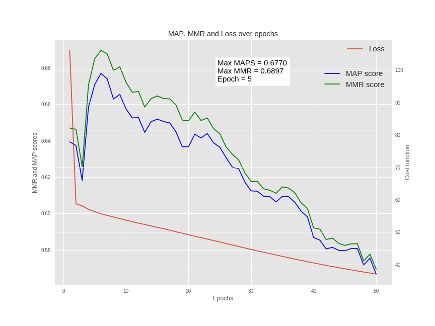

# MLND-Capstone

Implementation of **Bi-CNN** and **Attention based CNN** for Answer Selection Task in **Tensorflow**

### Paper:
[ABCNN: Attention-Based Convolutional Neural Network
for Modeling Sentence Pairs](http://www.aclweb.org/anthology/Q16-1019)

## Problem statement

In a **AS** task, we are given a number of sentences and we have to choose the sentence which can answer the question in isolation. For example,

**Question**: Who	is	the	UK’s	best-selling	author?

**A1:**	J.K. Rowling has led a “rags to riches” life story, in which she progressed from living on state benefits to multi-millionaire status within five years.

**A2:**	She is the United Kingdom’s best selling author since records began, with sales in excess of £238m.

The correct answer is **A2** because it answers the question in isolation. 

## Dataset

### WikiQA

The WikiQA corpus is a publicly available set of question and sentence pairs, collected and annotated for research on open-domain question answering. You can download the entire WikiQA dataset [here.](https://www.microsoft.com/en-us/download/details.aspx?id=52419)

### TREC-QA

TREC-QA corpus is a similar set of question and sentence pairs. It is available [here.](https://trec.nist.gov/data/qa.html)

Both datasets are also available in the dataset folder.


## Dataset format

This section provides insight into how the data is structured in the .txt files.

| Question      | Answer | Labels     |
| :---:        |    :----:   |          :---: |
| how are glacier caves formed ?      | A partly submerged glacier cave on Perito Moreno Glacier.        |   0 |
| how are glacier caves formed ?   | Ice formations in the Titlis glacier cave            | 0      |
| how are glacier caves formed ?   | Glacier caves are often called ice caves, but this term ..        | 0      |
| how are glacier caves formed ?   | A glacier cave is a cave formed within the ice of a glacier .        | 1     |
| how are glacier caves formed ?   | The ice facade is approximately 60 m high         | 0      |

The correct answer is the fourth and this is indicated in the label by a 1.


## Software Requirements

```bash
tensorflow
nltk
numpy
scipy
matplotlib
gensim
keras
scipy
scikit-learn
```
## Setup
Download and extract the pretrained word2vec **GoogleNews-vectors-negative300.bin** model from [here](https://code.google.com/archive/p/word2vec/).
Make sure to extract the .bin file from the .gz file and place it in the root folder of the project.

## Results

### Baseline Scores

| Baseline | Scores |
| :----: | :------: |
| MAP | 0.6520 | 
| MMR | 0.6652 |

### BCNN 

| BCNN | Scores |
| :----: | :------: |
| MAP | 0.6770 | 
| MMR | 0.6897 |



### ABCNN-1

| ABCNN | Scores |
| :----: | :------: |
| MAP | 0.6725 | 
| MMR | 0.6872 |


